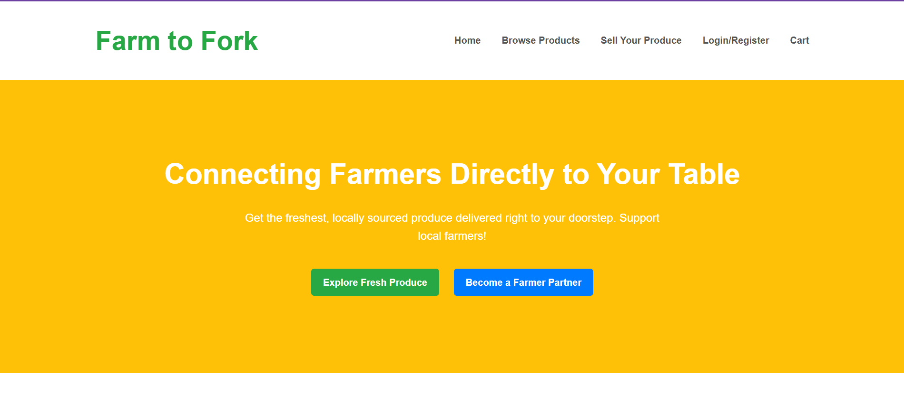
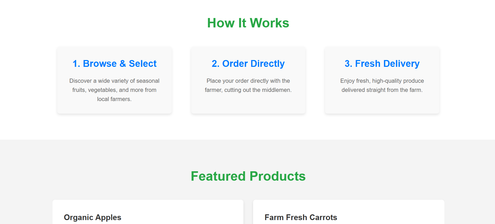
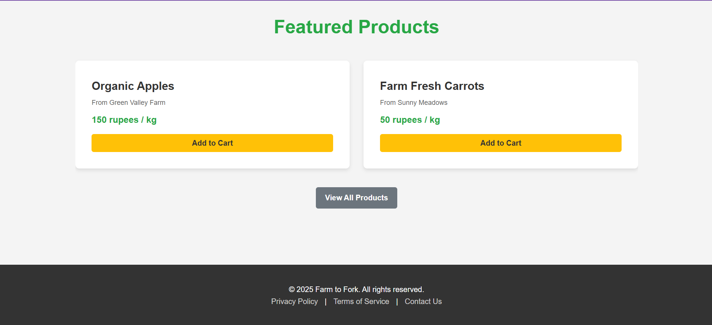
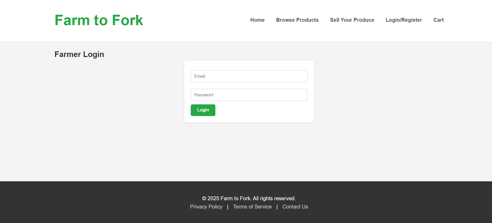
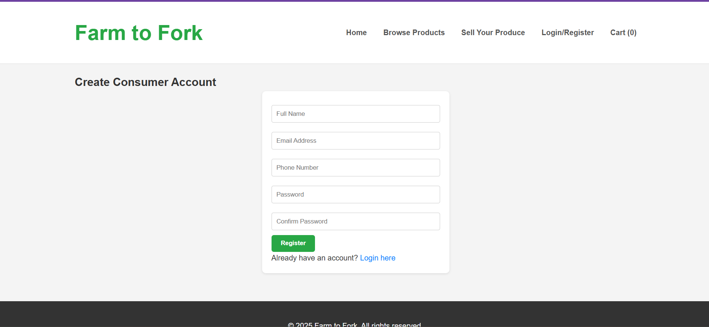
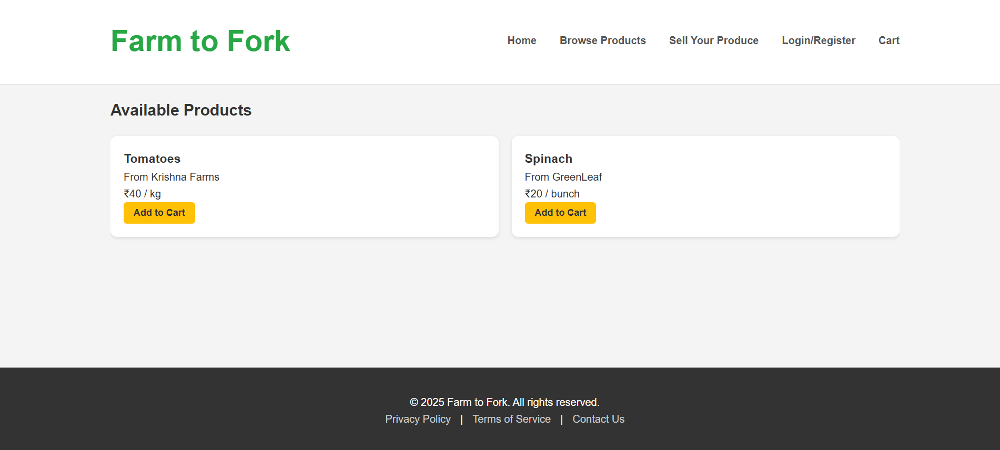
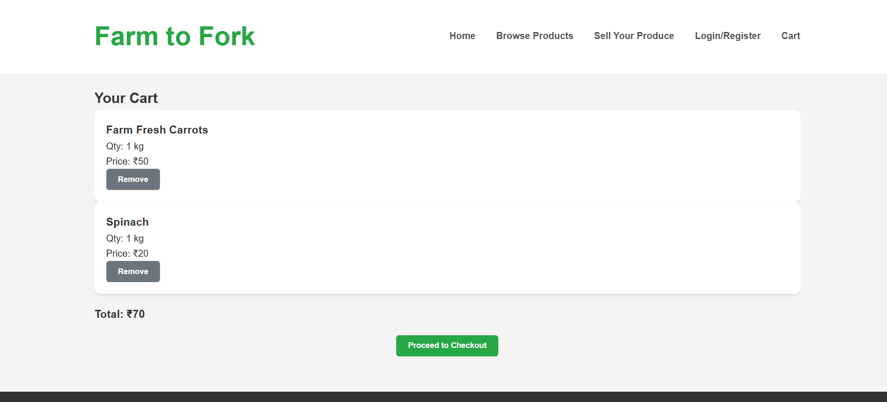

# 🌱 Farm to Fork – More Than Just a Marketplace: A Step Towards Fairer Farming and Fresher Food for Everyone 🍅🌾  

**Farm to Fork** is a full-stack web application designed to bridge the gap between farmers and consumers. It enables farmers to sell their products directly, while consumers can easily browse, purchase, and manage their orders online. The app aims to simplify the farm-to-consumer supply chain, ensuring fresher products and fair pricing.  

---

## 🚀 Key Features  

### For Consumers:  
- Browse a variety of fresh farm products.  
- Add products to cart and manage orders.  
- Login/Signup for a personalized experience.  
- View product details and prices easily.  

### For Farmers:  
- Login/Signup as a farmer.  
- Add and manage products for sale.  
- View orders and manage inventory.  

### General Features:  
- Clean, responsive, and user-friendly interface.  
- Fast and seamless interaction between frontend and backend.  
- Secure authentication for both farmers and consumers.  

---

## 📸 Screenshots  
Here are some screenshots of the Farm to Fork app : 




 
 
  
  

---

## 💻 Technologies Used  
- **Frontend:** HTML, CSS, JavaScript  
- **Backend:** Node.js, Express.js  
- **Database:** MongoDB (for storing users, products, and orders)  
- **Other:** REST APIs for communication between frontend and backend  

---

## ⚡ Why This App is Valuable  
- Simplifies the supply chain by connecting farmers directly to consumers.  
- Helps farmers earn fair prices for their products.  
- Provides consumers with fresh, local produce.  
- Scalable architecture to support more features and users in the future.  

---

## 🌟 Future Enhancements  
- Complete integration of all routes for smoother functionality.  
- User reviews and ratings for products.  
- Order tracking for consumers.  
- Advanced search and filter options for easier browsing.  
- Mobile app version for wider accessibility.  
- Analytics dashboard for farmers to track sales and inventory.  

---

## 📌 Getting Started  
1. Clone the repository:  
   ```bash
   git clone https://github.com/Geetha-Posa/FarmToFork.git
   npm install
   npm start
  ```
